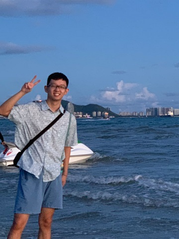

# About Me

Here is **Yijian Lu (Lucas, 呂奕鑒)**.

I am currently a final-year M.Phil student in The Chinese University of Hong Kong, supervised by Prof. [Irwin King](https://scholar.google.com/citations?user=MXvC7tkAAAAJ&hl=en). Before that, in 2022, I received my Bachalor's degree in Computer Science from CUHK as well. My research interest is Natural Language Processing, specifically including Large Language Model, Text Watermarking, LLM Safety and Fact-checking.

📧 Please feel free to contact me via luyijian@link.cuhk.edu.hk.

## 🎓 Academic Background

- **Sep 2024 - Future:** Tsinghua University (Incoming CS Phd, supervised by Prof. [Juanzi Li](https://keg.cs.tsinghua.edu.cn/persons/ljz/))
- **Aug 2022 - July 2024:** The Chinese University of Hong Kong (MPhil, CS, supervised by Prof. [Irwin King](https://scholar.google.com/citations?user=MXvC7tkAAAAJ&hl=en))
- **Sep 2018 - July 2022:** The Chinese University of Hong Kong (Bsc, CS)

---

## 🧠 Research Interests

- Text Watermarking for LLMs
- LLM, LLM Safety in general
- Fact-checking

My current research focuses on **Text Watermarking for LLMs** and **LLM Safety** in general. My interest lies on everything about LLMs, and I wish to explore more research topics in my Phd study.

## 🆕 News and Updates

- **31 May 2024:** 🎉 Passed my M.Phil oral defense with the topic "Text Watermarking in the Era of Large Language Models: Enhancement and Extension"
- **26 May 2024:** Invited to serve as a reviewer for [NeurIPS 2024](https://neurips.cc/)
- **16 May 2024:** 🎉 My paper "[An Entropy-based Text Watermarking Detection Method](https://arxiv.org/abs/2403.13485)" has been accepted to [ACL 2024](https://2024.aclweb.org/) Main Conference! 

## 📚 Selected Publications

### Text Watermarking

- An Entropy-based Text Watermarking Detection Method [[ACL 2024]](https://arxiv.org/abs/2403.13485)
- A survey of text watermarking in the era of large language models [[Arxiv]](https://arxiv.org/abs/2312.07913)
- MarkLLM: An Open-Source Toolkit for LLM Watermarking [[Arxiv]](https://arxiv.org/abs/2405.10051)

